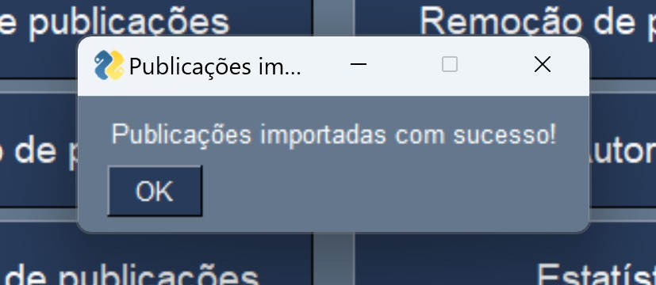

UNIVERSIDADE DO MINHO
Licenciatura em Engenharia Biomédica 

PROJETO DE ALGORITMOS E TÉCNICAS DE PROGRAMAÇÃ0

Realizado por:
Cláudia Reis-a103262
Ana Filipa Ribeiro- a105917
João Tomás Faria - a107277

1. INTRODUÇÃO

No âmbito da unidade curricular de Algoritmos e Técnicas de Programação, foi-nos proposta a realização de um projeto onde tínhamos de desenvolver um sistema em Python que permitisse criar, atualizar e analisar publicações científicas. Através de um dataset de publicações, o sistema deverá possibilitar a pesquisa de artigos usando filtros relevantes, tais como a data de publicação, as palavras-chave, autores, etc. Neste relatório, iremos abordar todas as funções necessárias e explicar os comandos associados para que o programa funcionasse corretamente.

1.1 ESTRUTURA DA BASE DE DADOS
    O dataset fornecido encontra-se em formato JSON e é estruturado como uma lista de dicionários. Cada dicionário representa uma publicação científica com os seguintes campos: título (title), resumo (abstract), palavras-chave (keywords), DOI, autores (authors), PDF, data de publicação (publish_date), URL.

1.2 ESTRUTURA DO PROGRAMA
    A aplicação foi organizada com uma interface gráfica que contém menus e botões para acessar às funcionalidades principais, tornando o uso mais intuitivo e eficiente. As opções disponíveis incluem:
        -Criação de Publicações: Permite adicionar novas publicações científicas da base de dados. O utilizador pode inserir informações detalhadas, como título, autores, palavras-chave e DOI.
        -Atualização de Publicações: Editar as informações de uma publicação já existente, selecionando-a.
        -Visualização de Publicações: Inclui filtros e ordenação de publicações por critérios como título, autor, palavras-chave ou data de publicação. As publicações filtradas podem ser exibidas em uma lista interativa.
        -Remoção de Publicações: Permite remover uma publicação selecionada da base de dados.
        -Estatísticas: Mostra gráficos relacionados a diferentes aspectos das publicações, tais como: Distribuição de publicações por ano ou mês; Número de publicações por autor (top 20); Distribuição de publicações de um autor ao longo dos anos; Frequência de palavras-chave mais utilizadas (top 20); Distribuição de palavras-chave por ano.
        -Autores: Exibe uma lista de autores, permitindo a consulta das publicações associadas a cada um.
        -Importação de Publicações: permite importar novos registos de outro ficheiro que tenha a mesma estrtura do ficheiro suporte (ata_medica_papers.JSON)
        -Exportação parcial de dados: permite exportar para um ficheiro os registos resultantes de uma pesquisa (apenas o subconjunto retornado pela pesquisa).
        -Sair: Sair da aplicação.

Para iniciar o projeto, implementamos o primeiro requisito do sistema: o carregamento da base de dados. O objetivo era criar um código capaz de carregar o dataset fornecido (ata_medica_papers.json) no arranque da aplicação, garantindo que os dados permanecessem disponíveis na memória e fossem armazenados de forma persistente em um arquivo de suporte à aplicação. Deste modo, iniciamos as primeiras linhas de código com "import FreeSimpleGUI as sg” (biblioteca usada para criar interfaces gráficas simples), "import json" (biblioteca usada para importar o módulo para trabalhar com arquivos e dados no formato JSON), “os” (biblioteca que auxilia na manipulação de caminhos de arquivos), “matplotlib.pyplot” (biblioteca que cria gráficos para análises estatísticas).

A linha de código "basedados = 'ata_medica _papers. json' define o nome do arquivo de base de dados, que armazenará as informações a serem carregadas pela aplicação.

2. FUNCIONALIDADES DO PROGRAMA
2.1 Gerenciamento de Dados
    FUNÇÃO CARREGAR_DADOS()
    Carrega o conteúdo do arquivo ata_medica_papers.json, no caminho calculado (caminho_basedados = os.path.join(os.path.dirname(os.path.abspath(__file__)), basedados)). Em caso de erro (arquivo inexistente ou corrompido), retorna uma lista vazia.

    FUNÇÃO SALVAR_DADOS(DADOS)
    Garante que as alterações feitas (como ao adicionar, atualizar, ou remover uma publicação) nos dados da aplicação sejam salvas permanentemente no arquivo JSON.   

2.2 Interface Gráfica 
2.2.1 Janela Principal
    FUNÇÃO CRIAR_JANELA_PRINCIPAL()
    Usando a biblioteca FreeSimpleGUI, exibe um menu inicial com uma mensagem inicial de boas-vindas (comando sg.Text) e botões (comando sg.Button) que permitem o utilizador selecionar as funcionalidades que pretende, tais como criar, atualizar, visualizar, remover publicações, acessar estatísticas, consultar autores ou encerrar a aplicação. O layout da interface gráfica é definido com listas, onde cada lista interna representa uma linha da janela. A primeira linha exibe o texto de boas-vindas e as linhas seguintes contêm os botões correspondentes às funcionalidades disponíveis. Esta estrutura do layout é passada para a função sg.Window, que cria a janela com o título "Menu Principal". Quando o código é inicado, a janela é exibida.

2.2.2 Janelas de Manipulação de Publicações
    FUNÇÃO CRIAR_JANELA_CRIACAO()
    Inicia uma janela sempre que o utilizador seleciona o botão "Criação de Publicações". Permite adicionar informações detalhadas para criar uma nova publicação (título, resumo, autores, etc.). O layout da janela é também organizado numa lista de componentes, onde cada linha contém um campo de entrada para o utilizador preencher (sg.InputText; sg.Multiline), como por exemplo o título do artigo, um resumo, palavras-chave, DOI, autores (com os nomes separados por vírgula), afiliações dos autores, URL do PDF do artigo, data de publicação e URL do artigo. Para além destes campos de texto, a janela também inclui dois botões: o de "Salvar", para salvar as informações inseridas na base de dados, e o de "Cancelar", para cancelar a operação e fechar a janela.Por fim, a função retorna a janela com o layout configurado e pronta para ser exibida.

    FUNÇÃO CRIAR_JANELA_VISUALIZACAO()
    Inicia uma janela sempre que o utilizador seleciona o botão "Visualização de Publicações". Permite que o utilizador visualize as publicações listadas na base de dados.  O layout da janela é composto por campos de entrada, onde o usuário pode filtrar as publicações com base em diferentes critérios, como o título, autor, afiliação, palavras-chave e data de publicação. Para além disso, há quatro botões: o de "Filtrar", que aplica os filtros inseridos pelo utilizador; o de  "Ordenar por Título", para ordenar as publicações por título; "Ordenar por Data", para ordenar por data de publicação; e "Fechar", que fecha a janela. A janela também contém uma lista (Listbox) para exibir os resultados das publicações filtradas ou ordenadas, com um tamanho de 80 colunas por 20 linhas. A função retorna a janela configurada e pronta para ser exibida, permitindo que o usuário consiga realizar buscas e visualizar os resultados.

    FUNÇÃO CRIAR_JANELA_ATUALIZACAO(titulos)
    Inicia uma janela sempre que o utilizador seleciona o botão "Atualização de Publicações". Recebe como parâmetro a lista de títulos, que contém os títulos das publicações disponíveis para atualização. O layout da janela é composto por um texto instrutivo ("Selecione a publicação para atualizar"), uma Listbox para exibir a lista de títulos das publicações e dois botões: "Selecionar" e "Cancelar". O botão "Selecionar" é usado para confirmar a escolha da publicação, enquanto o botão "Cancelar" permite ao utilizador fechar a janela sem realizar nenhuma ação. A função retorna a janela configurada com esses elementos. Esta janela possibilita ao utilizador visualizar a lista de publicações e escolher qual delas deseja atualizar, sendo um passo essencial na atualização das publicações existentes.

    FUNÇÃO CRIAR_JANELA_REMOCAO(titulos)
    Inicia uma janela sempre que o utilizador seleciona o botão "Remoção de Publicações". Permite ao utilizador remover uma publicação existente. Ela recebe como parâmetro uma lista de títulos, que contém os títulos das publicações disponíveis para remoção. O layout da janela consiste num texto elucidativo ("Selecione a publicação para remover") e uma lista de títulos de publicações, onde o usuário pode selecionar qual publicação deseja remover. A lista é representada por um componente sg.Listbox, que exibe os títulos e permite a seleção de um item. O tamanho da lista é ajustado para exibir até 20 títulos de cada vez. A janela também inclui dois botões: "Remover" e "Cancelar". O botão "Remover" deve acionar a remoção da publicação selecionada, enquanto o botão "Cancelar" fecha a janela sem fazer alterações. A função retorna a janela criada, permitindo que o utilizador consiga interagir com ela para selecionar e remover uma publicação.´

2.2.3 Janelas de autores 
    FUNÇÃO CRIAR_JANELA_AUTORES(autores) 
    Lista os autores presentes na base de dados e possibilita visualizar as publicações. O layout da janela, tal como na função apresentada anteriormente, inclui uma Listbox com o tamanho de 80 colunas e 20 linhas, mas ao contrário do que foi explicado anteriormente, esta lista exibe os autores passados como argumento para a função (a lista autores). A janela também contém dois botões: "Ver Publicações", que permite o utilizador visualizar as publicações associadas ao autor selecionado, e "Fechar", que fecha a janela. A função retorna então a janela configurada e pronta para ser exibida, permitindo ao usuário visualizar os autores e interagir com as opções disponíveis.   

    FUNÇÃO CRIAR_JANELA_PUBLICACOES_AUTOR(publicacoes, autor)
    Cria uma janela que exibe as publicações de um autor específico, o selecionado pelo utilizador na janela criada anteriormente. O layout da janela inclui um título que informa ao utilizador o autor das publicações (substituindo a variável autor pelo nome real do autor). Neste caso, a janela contém uma Listbox, que exibe as publicações passadas como argumento na lista de publicações, novamente com tamanho de 80 colunas e 20 linhas. Consequentemente, há um botão "Fechar", que fecha a janela quando utilizado. A função retorna a janela configurada, permitindo que o utilizador visualize as publicações do autor selecionado de forma interativa.

2.2.4 Estatísticas
    FUNÇÃO CRIAR_JANELA_ESTATISTICAS()
    Mostra uma interface que permite ao utilizador visualizar diferentes estatísticas relacionadas às publicações. O layout da janela inclui uma mensagem introdutória que orienta o utilizador a selecionar a estatística desejada, seguida por uma lista de botões, cada um representando uma opção específica. Entre as estatísticas disponíveis estão a distribuição de publicações por ano, a distribuição de publicações por mês em um ano específico, o número de publicações por autor considerando os 20 autores mais produtivos, a distribuição de publicações de um autor ao longo dos anos, a distribuição das palavras-chave mais frequentes, limitando-se às 20 principais, e a distribuição anual das palavras-chave mais utilizadas.Para além destas opções, a janela conta com um botão "Voltar", que permite ao utilizador retornar à janela anterior. A função retorna a janela configurada para que o utilizador possa interagir com ela e selecionar a estatística desejada.

2.2.5 Importação de Publicações 
    FUNÇÃO CRIAR_JANELA_IMPORTAR
    Cria uma janela para o utilizador selecionar um arquivo JSON. Após a seleção, o caminho do arquivo é passado para a função importar_json.

    FUNÇÃO IMPORTAR_JSON(caminho_arquivo)
    Lê o arquivo JSON selecionado pelo utilzador e carrega os dados nele contidos.

2.2.6 Exportação de Publicações
    FUNÇÃO EXPORTAR_PUBLICACOES()
    Na janela visualização de publicações, existe um botão "Exportar Publicações". Ao ser selecionado, a função exportar para um ficheiro os registos resultantes da pesquisa anterior. Em primeiro lugar, é solicitado ao utilizador o local e o nome do arquivo para salvar os dados em formato JSON. Em segundo lugar, os dados são guardados no arquivo, formatando-os para legibilidade. E por último, notifica o utilizador se os dados foram guardados com sucesso ou não.

2.2.7 Ajuda 
    FUNÇÃO CRIAR_JANELA_AJUDA()
    Cria uma janela de ajuda, que é exibida ao utilizador quando este seleciona o botão AJUDA. Esta janela fornece informações detalhadas sobre as funcionalidades que o programa pode oferecer. 

2.3 Funções de Apoio
Para que o programa funcione, para além de ser necessária a criação de janelas, é necessário definir funções para que as mesmas funcionem corretamente:
    
    2.3.1 FUNÇÃO FILTRAR_ARTIGOS(dados, filtro_titulo, filtro_autor, filtro_afilacao, filtro_palavras_chave, filtro_data_publicacao)
    Filtra uma lista de artigos com base nos critérios fornecidos pelo utilizador. Por conseguinte, ela recebe os parâmetros de filtro, como título, autor, afiliação, palavras-chave e data de publicação, e verifica se cada artigo corresponde aos critérios especificados. Para o filtro de título, dá-se a verificação se o título do artigo contém o texto fornecido, com o detalhe de ignorar maiúsculas e minúsculas ('title', '').lower(). O filtro de autor deve averiguar se algum dos autores do artigo contém o nome fornecido, enquanto o filtro de afiliação faz o mesmo para as afiliações dos autores. O filtro de palavras-chave constata se as palavras-chave do artigo contêm o texto fornecido. Já o filtro de data de publicação compara a data do artigo com a data fornecida, após remover os hífens para garantir a compatibilidade (replace("-", "")). Se um artigo corresponder a todos os filtros aplicados, ele é adicionado à lista de resultados. Caso contrário, o mesmo é eliminado. Por fim, a função retorna a lista de artigos que atendem a todos os critérios de pesquisa fornecidos. Essa funcionalidade é útil para permitir que os utilizadores encontrem artigos específicos com base em múltiplos parâmetros de busca.

    2.3.2 FUNÇÃO LISTAR_AUTORES(dados)
    Extrai e lista os autores únicos de uma lista de artigos. Esta função recebe uma lista de dados de artigos (onde cada artigo pode ter uma lista de autores) e para cada artigo recebido, a mesma percorre a lista de autores e adiciona o nome de cada autor a um conjunto (set). O uso de um conjunto é importante uma vez que o mesmo garante que os autores sejam únicos, ou seja, se o mesmo autor aparecer em vários artigos, ele será listado apenas uma vez. Depois de percorrer todos os artigos, a função converte o conjunto de autores de volta para uma lista e a retorna. Essa função é útil para obter uma lista de autores distintos, sem duplicações, a partir dos artigos armazenados.

    2.3.3 FUNÇÃO OBTER_PUBLICACOES_POR_AUTORES(dados, autor_procurado)
    Retorna uma lista de títulos de publicações associadas a um autor específico. Por isso, recebe dois parâmetros: “dados”, que é uma lista de artigos, e “autor_procurado”, que é o nome do autor que queremos buscar. A função usa uma compreensão de lista para renovar os artigos em dados. Para cada artigo, ela verifica se o autor procurado está presente na lista de autores do artigo. Caso o nome do autor (autor.get('name')) coincida com o nome do autor que está a ser procurado (autor_procurado), o título do artigo (artigo['title']) é adicionado à lista de publicações e a função vai retornar essa lista de títulos de publicações em que o autor está envolvido. Se o oposto ocorrer,  a função retornará uma lista vazia.

2.4 Análise de Dados
2.4.1 Estatísticas Gerais
FUNÇÃO DISTRIBUIR_PUBLICACOES_POR_ANO(dados): Conta a quantidade de publicações por ano. Deste modo, esta recebe como entrada a base de dados, que contém as publicações e para cada artigo na lista, a função tenta aceder o ano de publicação, que é extraído dos primeiros quatro caracteres do campo publish_date. Este ano é usado como chave em um dicionário anos, e o valor correspondente a cada ano é incrementado a cada vez que um artigo é encontrado para aquele ano. Se um artigo não contiver o campo publish_date, a função captura um erro de KeyError e imprime uma mensagem informando que o artigo não possui a data de publicação. No final, a função retorna o dicionário anos, que contém os anos como chaves e o número de publicações para cada ano como valores.

FUNÇÃO DISTRIBUIR_PUBLICACOES_POR_MES(dados, ano): Conra a quantidade de publicações por mês dentro de um ano específico. Ela recebe dois parâmetros: dados, que é a lista de base de dados, e ano, que é o ano para o qual se deseja calcular a distribuição mensal de publicações.
Primeiro, a função cria um dicionário meses, onde as chaves são os meses (de "01" a "12") e os valores são inicializados como zero. Esse dicionário serve para armazenar a contagem de publicações para cada mês. Em seguida, para cada artigo na lista de dados, a função tenta acessar o campo publish_date (data de publicação). Se o campo estiver presente e o ano da data coincidir com o ano fornecido, o mês é extraído a partir dos caracteres da posição 5 a 7 da data (data[5:7]). A função verifica se o mês extraído está presente no dicionário meses e, caso positivo, incrementa o contador correspondente ao mês. Se um artigo não contiver o campo publish_date, a função captura o erro de KeyError e imprime uma mensagem informando que a data de publicação está ausente. Ao final, a função retorna o dicionário meses, que contém a quantidade de publicações por mês para o ano fornecido.

2.4.2 Estatísticas de Autores
FUNÇÃO NUMERO_PUBLICACOES_POR_AUTOR(dados): Conta o número de publicações realizadas por cada autor a partir de uma lista de artigos. Ela começa criando um dicionário vazio chamado autores, onde cada chave será o nome de um autor e o valor será o número de publicações associadas a ele. Em seguida, a função percorre cada artigo na lista de dados e, dentro de cada artigo, percorre os autores registrados. Para cada autor, ela verifica se o nome já existe no dicionário; se sim, incrementa o número de publicações desse autor em 1, caso contrário, adiciona o autor ao dicionário com o valor 1. Após contar as publicações de todos os autores, a função ordena o dicionário em ordem decrescente de publicações e retorna um novo dicionário contendo apenas os 20 autores com mais publicações. Isso permite identificar rapidamente os autores mais produtivos na base de dados fornecida.

2.4.3 Estatísticas de Palavras-Chave
FUNÇÃO DISTRIBUIR_PALAVRAS_CHAVE(dados):  Calcula a distribuição das palavras-chave mais frequentes entre os artigos, ou seja, contar quantas vezes cada palavra-chave aparece em todos os artigos. Ela começa criando um dicionário vazio chamado palavras_chave, onde as chaves são as palavras-chave e os valores são as contagens de quantas vezes cada palavra apareceu. Para cada artigo nos dados, a função tenta acessar o campo keywords, que contém uma lista de palavras-chave separadas por vírgulas. Essas palavras são então divididas em uma lista usando o método split(','). Para cada palavra, ela remove espaços em branco com o método strip() e atualiza a contagem dessa palavra no dicionário palavras_chave. Caso algum artigo não tenha o campo keywords, a função captura o erro de chave e imprime uma mensagem de erro. Após processar todos os artigos, a função retorna um dicionário com as 20 palavras-chave mais frequentes, ordenadas de forma decrescente pela frequência de ocorrência.

FUNÇÃO DISTRIBUIR_PALAVRAS_CHAVE_POR_ANO(dados): Calcula a distribuição das palavras-chave em artigos, agrupadas por ano de publicação. O processo começa criando um dicionário vazio `palavras_chave_por_ano`, onde as chaves são os anos e os valores são dicionários que armazenam a contagem de cada palavra-chave para aquele ano. Para cada artigo na base de dados, a função tenta extrair o ano de publicação a partir do campo `publish_date` e, em seguida, divide as palavras-chave (armazenadas no campo `keywords`) em uma lista, separando-as por vírgulas. Cada palavra-chave é então limpa (removendo espaços extras com o método `strip()`) e a contagem de cada palavra-chave para o respectivo ano é atualizada no dicionário `palavras_chave_por_ano`. Após processar todos os artigos, a função filtra as palavras-chave para garantir que apenas as que aparecem 2 ou mais vezes por ano sejam mantidas. Isso é feito para evitar incluir palavras-chave pouco relevantes. A função então retorna o dicionário `palavras_chave_por_ano`, que contém, para cada ano, as palavras-chave mais frequentes e suas respectivas contagens. Se algum artigo não tiver os campos necessários (`publish_date` ou `keywords`), a função captura o erro de chave e imprime uma mensagem informando o erro.

2.4.4 Gráficos
FUNÇÃO GERAR_GRAFICOS(x, y, titulo, xlabel, ylabel): Cria  um gráfico de barras utilizando a biblioteca matplotlib. Ela recebe os parâmetros x, y, titulo, xlabel e ylabel, onde x são os valores para o eixo horizontal (geralmente categorias ou anos), y são os valores para o eixo vertical (como contagens ou frequências), titulo é o título do gráfico, xlabel é o rótulo do eixo x e ylabel é o rótulo do eixo y. A função cria uma figura de tamanho 10x6 polegadas, gera o gráfico de barras com a cor skyblue, e adiciona o título e os rótulos nos eixos. Os rótulos do eixo x são rotacionados em 45 graus para evitar sobreposição e melhorar a legibilidade. Por fim, a função ajusta o layout do gráfico e exibe-o na tela.

3. MENU PRINCIPAL

Depois de todas as funções estarem definidas, é necessário definir uma função principal que chame todas as funções e as execute, de modo a que o programe funcione corretamente consoante as opções selecionadas pelo utilizado.

Aqui estão alguns exemplos do funcionamento do programa:

Janela Principal:

Criação de Publicações:

Visualização de Publicações:

Exportação:

Atualização de Publicações: 

Remoção de Publicações:

Janela de Autores:

Estatísticas:

Importação:

4. CONCLUSÃO 
Em suma, este projeto foi bastante desafiante e ajudou na consolidação dos nossos conhecimentos a esta unidade curricular. Através das diversas etapas deste trabalho, foi possível aprofundar a compreensão teórica e prática sobre os tópicos abordados, permitindo uma aplicação mais eficaz dos conceitos aprendidos. Deste modo, é possível afirmar que este projeto foi um passo importante no fortalecimento da nossa formação académica.

